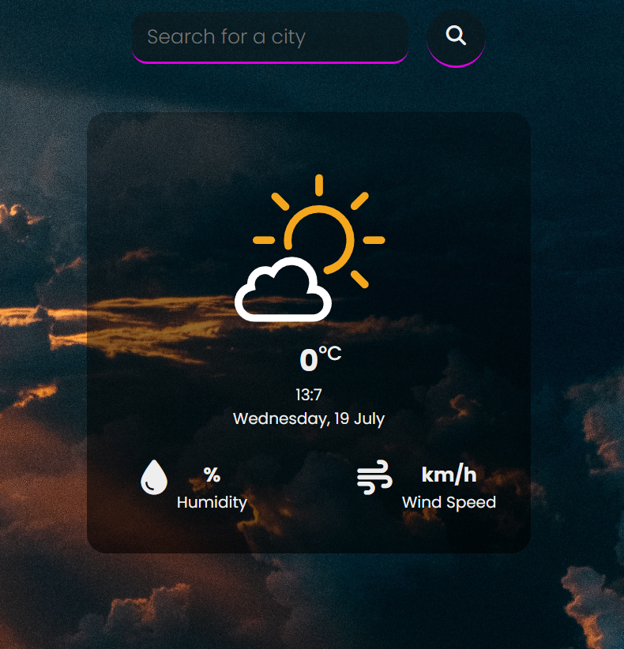

# Elementicon

> A live Weather App that allows you to search by city using a weather API.
> Live demo [here](https://elementicon.netlify.app/).

## Table of Contents

- [General Info](#general-information)
- [Technologies Used](#technologies-used)
- [Features](#features)
- [Screenshots](#screenshots)
- [Project Status](#project-status)
- [Room for Improvement](#room-for-improvement)
- [Contact](#contact)

## General Information

<ul><li>The goal of this project was to create a weather app that allows you to search for the weather of any city in the world.</li></ul>

## Technologies Used

<ul>
  <li>HTML5</li>
  <li>CSS3</li>
  <li>JAVASCRIPT</li>
  <li>Open Weather API</li>
  <li>Responsive Web Development</li> </ul>

## Features

List the ready features here:

<ul>
  <li>Search engine ready for searching the weather in any city</li>
  <li>Shows current date and time</li></ul>

## Screenshots

